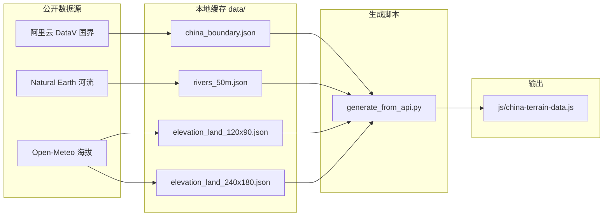

# 地图数据生成与获取

本文说明 `simple_sango` 如何从公开地理数据源生成 **240×180** 中国地形栅格，以及缓存、断点续跑与在浏览器中查看的方式。

## 概述

| 项目 | 说明 |
|------|------|
| 栅格尺寸 | 240 列 × 180 行（`js/map-data.js` 中 `MAP_WIDTH` / `MAP_HEIGHT`） |
| 地理范围 | 经度 98°–123.5°E，纬度 17.5°–42°N（东汉三国大致范围 + 东部海域） |
| 主输出 | `js/china-terrain-data.js`（每格一个地形字符） |
| 主生成脚本 | `scripts/generate_from_api.py` |
| 备选脚本 | `scripts/generate_from_jpg.py`（从根目录 JPG 颜色识别） |

地形类型与单字符编码：

| 字符 | 地形 | 说明 |
|------|------|------|
| `s` | sea | 海域 |
| `p` | plain | 平原 |
| `h` | hill | 丘陵 |
| `f` | forest | 森林 |
| `m` | mountain | 山地 |
| `r` | river | 河流 |
| `d` | desert | 沙漠 |
| `w` | swamp | 沼泽 |
| `c` | coast | 海岸 |

前端通过 `CHINA_TERRAIN_ROWS` + `CHINA_TERRAIN_DECODE` 读入，`map-data.js` 的 `buildThreeKingdomsMap()` 将其铺到可交互地图上。

## 数据流程



生成步骤（API 方式）：

1. **国界** — 判断格点是否在陆地上（中国边界内）。
2. **河流** — 格点是否靠近 Natural Earth 河流线。
3. **海拔** — 按海拔 + 经纬度规则分类平原/丘陵/森林/山地/沙漠/沼泽等。
4. **海岸** — 陆地邻接海域的格标为海岸 `c`。
5. 写出 `js/china-terrain-data.js`。

## 外部 API 与数据提供方

### 1. 海拔（慢速任务主要消耗此项）

| | |
|---|---|
| **服务** | Open-Meteo Elevation API |
| **URL** | `https://api.open-meteo.com/v1/elevation` |
| **提供方** | [Open-Meteo](https://open-meteo.com/) |
| **底层 DEM** | Copernicus DEM 90m（约 90 米分辨率全球数字高程） |
| **认证** | 无需 API Key（免费公开，有频率限制） |

请求示例（批量多点）：

```
GET https://api.open-meteo.com/v1/elevation?latitude=30.1,30.2&longitude=104.0,104.1
```

响应中的 `elevation` 数组与请求的经纬度一一对应。

### 2. 国界 / 海岸线

| | |
|---|---|
| **服务** | 阿里云 DataV 地理边界 GeoJSON |
| **URL** | `https://geo.datav.aliyun.com/areas_v3/bound/100000.json` |
| **提供方** | 阿里云 DataV |
| **用途** | `adcode=100000` 中国国界，区分陆地与海洋 |
| **本地缓存** | `data/china_boundary.json` |

### 3. 河流

| | |
|---|---|
| **数据** | Natural Earth 50m 河流与湖泊中心线 |
| **URL** | `https://raw.githubusercontent.com/nvkelso/natural-earth-vector/master/geojson/ne_50m_rivers_lake_centerlines.geojson` |
| **提供方** | [Natural Earth](https://www.naturalearthdata.com/) |
| **本地缓存** | `data/rivers_50m.json` |

## 生成方式

### 方式 A：默认快速生成（推荐）

从已有的 **120×90** 海拔缓存双线性插值到 **240×180**，数秒内完成。

```bash
python scripts/generate_from_api.py
```

等价入口：

```bash
python scripts/build_china_terrain.py
```

若 `data/elevation_land_120x90.json` 不完整，脚本会自动向 Open-Meteo 补拉粗网格陆地格（约 7 000+ 点，比细网格快得多）。

### 方式 B：逐格拉取 240×180 海拔（慢，可断点续跑）

对每个陆地格单独请求 API，精度更高，但陆地格约 **30 816** 个，受 Open-Meteo 限速影响，完整跑完需数小时。

**Windows 双击：**

```
fetch_elevation_240x180.bat
```

**命令行：**

```bash
python scripts/generate_from_api.py --fetch-all-elevation --batch-size 20 --sleep-seconds 4
```

| 参数 | 默认 | 说明 |
|------|------|------|
| `--fetch-all-elevation` | 否 | 开启后对 240×180 陆地格逐格请求 API |
| `--batch-size` | 30 | 每批请求的格点数；越小越稳、越慢 |
| `--sleep-seconds` | 1.8 | 每批之间的等待秒数 |

**断点续跑：** 进度写入 `data/elevation_land_240x180.json`，每批成功后立即保存。中断后重新运行同一命令或 bat 即可从缓存继续。

**查看当前缓存进度：**

```bash
python scripts/show_elevation_cache.py
```

输出示例：`Cached elevation points: 5280`（陆地总数约 30 816，比例即完成度）。

### 方式 C：从 JPG 地形图生成（备选）

将一张中国地形 JPG 放在项目根目录，按像素颜色 + 国界掩膜识别地形。

```bash
pip install pillow
python scripts/generate_from_jpg.py
```

额外输出 `js/jpg-source-config.js`（原图对照模式用）。需已有 `data/china_boundary.json`（可先跑一次 API 生成脚本下载国界）。

## 文件说明

### 脚本

| 文件 | 作用 |
|------|------|
| `scripts/generate_from_api.py` | 主生成器：国界 + 河流 + 海拔 + 分类 |
| `scripts/generate_from_jpg.py` | 备选：从 JPG 颜色生成 |
| `scripts/build_china_terrain.py` | 调用 `generate_from_api.py` 的快捷入口 |
| `scripts/show_elevation_cache.py` | 打印 240×180 海拔缓存点数 |
| `fetch_elevation_240x180.bat` | Windows 慢速全量海拔拉取 + 生成 |

### 缓存（`data/`）

| 文件 | 内容 | Git |
|------|------|-----|
| `china_boundary.json` | 中国国界 GeoJSON | 已纳入仓库 |
| `rivers_50m.json` | 河流矢量 GeoJSON | 已纳入仓库 |
| `elevation_land_120x90.json` | 粗网格陆地海拔点 | 已纳入仓库 |
| `elevation_land_240x180.json` | 细网格陆地海拔点 | **gitignore**，本地生成 |

`data/.gitignore` 忽略 `elevation_land_*.json`，避免把大体积、可再生的 API 缓存提交进仓库（120×90 文件若已在仓库中则保留）。

### 输出（前端加载）

| 文件 | 内容 |
|------|------|
| `js/china-terrain-data.js` | `CHINA_TERRAIN_ROWS` 地形字符矩阵 |
| `js/map-data.js` | 地图尺寸、地形定义、城市与州郡逻辑 |
| `js/map-renderer.js` | 栅格绘制、缩放、坐标轴、视图切换 |

## 地形分类规则（API 方式）

在 `generate_from_api.py` 的 `classify()` 中：

1. 国界外 → `sea`
2. 靠近 Natural Earth 河流线（约 0.12° 宽度）→ `river`
3. 西北低海拔区 → `desert`
4. 洞庭–鄱阳等低海拔湖盆 → `swamp`
5. 按海拔：低于 200 m 平原，200–500 m 丘陵，500–1200 m 丘陵或华东森林，1200 m 以上山地
6. `apply_coast()`：平原/丘陵/森林/沙漠邻接海域 → `coast`

## 在浏览器中查看

生成完成后用浏览器打开根目录 `index.html`（无需构建）。

- 默认显示 **彩色地形栅格**
- 可切换「原图对照」（JPG 模式需 `generate_from_jpg.py` 生成配置且根目录有 JPG）
- 放大后可看到格点坐标与 X/Y 轴标注

## 常见问题

### HTTP 429（频率限制）

Open-Meteo 对免费请求有速率限制。处理方式：

- 增大 `--sleep-seconds`（如 4–6）
- 减小 `--batch-size`（如 10–20）
- 脚本会自动重试并加长等待；缓存不丢，可隔天继续

### 中断后进度会丢吗？

不会。`elevation_land_240x180.json` 每批写入。但 **`js/china-terrain-data.js` 只在整次脚本成功结束时更新**；中途退出只保留海拔缓存。

### 粗网格 vs 细网格海拔

| 模式 | 陆地 API 请求数 | 耗时 | 精度 |
|------|-----------------|------|------|
| 默认插值（120→240） | 0（用已有粗缓存） | 秒级 | 插值平滑，细节略糊 |
| `--fetch-all-elevation` | ~30 816 | 数小时 | 每格实测 DEM |

日常开发用默认模式即可；需要与 DEM 逐格对齐时用方式 B。

### 依赖

- Python 3.8+
- 标准库即可（`urllib`、`json` 等）
- JPG 方式额外需要：`pip install pillow`

## 相关链接

- [Open-Meteo Elevation API 文档](https://open-meteo.com/en/docs/elevation-api)
- [阿里云 DataV 地理小工具](https://datav.aliyun.com/portal/school/atlas/area_selector)
- [Natural Earth Data](https://www.naturalearthdata.com/)
- [Copernicus DEM](https://dataspace.copernicus.eu/explore-data/data-collections/copernicus-contributing-missions/collections-description/COP-DEM)
